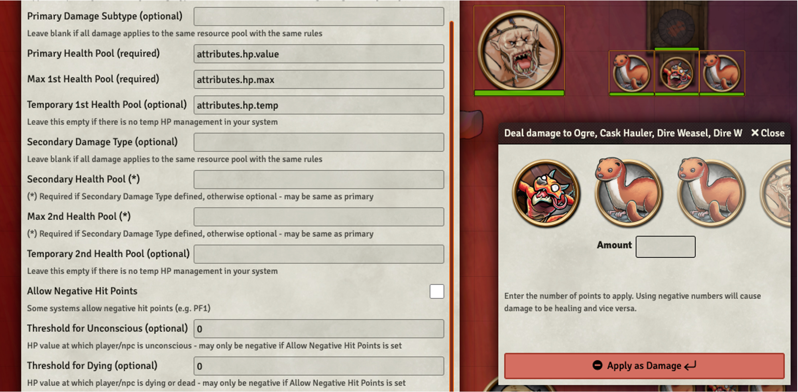
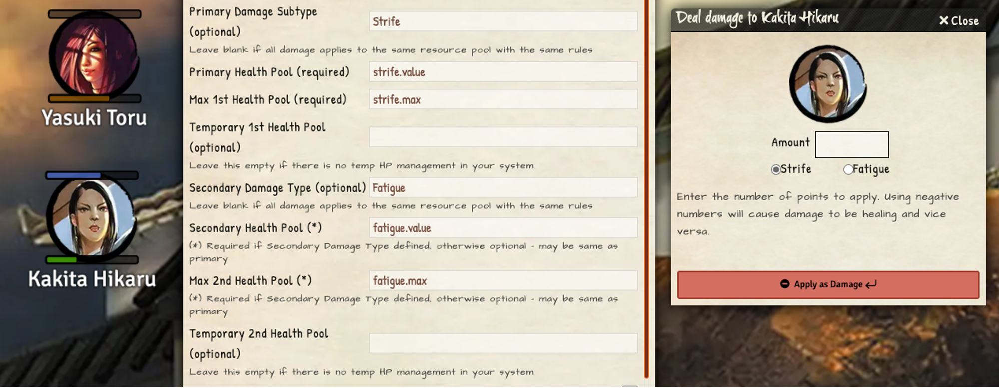
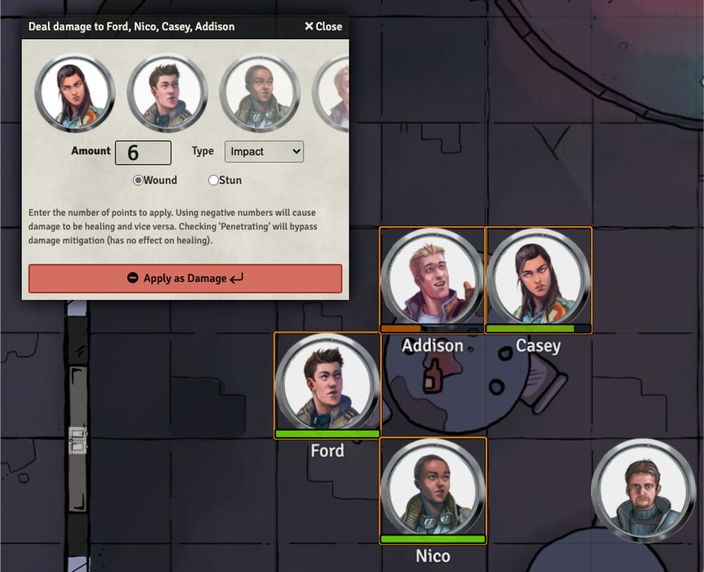

# Token Health - LANCER edition

Apply damage/healing with a few keystrokes to all selected tokens at once. Fork from the original module updated to work with LANCER 1.2.0 on FoundryVTT.

Note: If you're applying heat to something that automatically takes damage instead (i.e. a pilot), you will have to actually enter it as damage rather than heat.

Thanks to [schlosrat](https://github.com/schlosrat) for the base module, a merge of this version with the original may or may not happen once I have talked with them about it.

⚠️ If your version is 0.1.3, you will have to reinstall the module.

## Description

This is a module for [FoundryVTT](https://foundryvtt.com/) intended for GMs that want to apply damage or healing more easily. Without this mod, you have to click several times to adjust the hit points of a token. With Token Health installed, you can press a hotkey, enter the amount of damage or healing, and then press Enter to apply it.

Token Health also supports a detailed system of (optional) automatic token chat messages to alert players and GM to what's going on. All chat messages are user configurable. Details indicating how much healing or damage has been applied may be limited to messages sent to the GM or can be shared with the players.

## Install

You can install this module directly from the "Add-on Modules" page on the FoudryVTT Setup screen. 

Make sure to enable the module once your world is launched, in the Manage Modules setting page. This module also requires and depends on the Library: DF Hotkeys module which must be installed and enabled.

## Usage

Before using Token Health it is recommended that you first check and configure the settings in the Module Settings. Token Health will automatically recognize and attempt to configure reasonable defaults based on the game system in use for the world and your language setting; but these may not always be the right settings for you, and you may want to tweak things to suit yourself. See **Module Configuration** below. Currently the following game systems have pre-defined default settings that should get you up and running:
- AGE System (unofficial)
- DnD5e - Fifth Edition System
- Legend of the Five Rings (5th Edition)
- Pathfinder 1
- Pathfinder 2nd Edition 
- Savage Worlds Adventure Edition (SWADE)
- TORG Eternity
- Star Wars FFG (SFRPG)
- The Expanse RPG (AGE) *Work In Progress*
- LANCER

If your preferred game system is not on that list then generic defaults will be used and it's **very likely** you'll need to do at least a minimum amount of configuration to make sure damage and healing are being applied to the correct attribute! If you would like to see your preferred system supported with default settings, or if you find an issue with the default settings applied to one of the systems listed above, please open an GitHub issue for this with specific details about the system you'd like supported and the settings you need.

### Use Token Health

NOTE: To use Token Health you must either have one or more tokens selected or one or more tokens targeted, depending on the hot key you're presseing! If you press a hotkey mapped to an effect for *selected* tokens and there are no selected tokens, then the dialog will not be presented. Similarly if you press a hotkey mapped to an effect for *targeted* tokens and there are not tokens currently targeted, then the dialog will not be presented.

1. Select/target one or more token(s)
1. Press the **hot key** (default: <kbd>Enter</kbd>) to display the Damage dialog or the **alternate hot key** (default: <kbd>Shift</kbd> + <kbd>Enter</kbd>) to display the Healing dialog. To apply damage/healing to **targeted tokens** instead of **selected tokens**, add the <kbd>Alt</kbd> key by default.
1. Enter a value
1. Optional: Select the damage type (pulldown menu) - this option is only present if more than one Damage Type is defined in the module settings (e.g. Impact, Ballistic, Penetrating)
1. Optional: Select the damage subtype (radio button) - this option is only present if more than one Damage Subtype is defined in the module settings (e.g. Wounds vs. Stun, etc.)
1. Validate by pressing <kbd>Enter</kbd> or by clicking the big button

### What you can do

#### Apply Damage to *Selected* Token(s)
- Multiple tokens may be selected.
- Press the **hot key** and enter a value to apply **damage** to the selected token(s).
	- To help ensure you've got the right tokens selected the name for each token will appear in the title bar of the dialog box.
	- Optionally, up to four selected token thumbnail images will also be shown inside the dialog box with decreasing opacity (the fourth will be cut off)
- Press the **key key** and enter a ***negative value*** to apply **healing** to the selected token(s)

#### Apply Healing to *Selected* Tokens(s)
- Multiple tokens may be selected.
- Press the **alternate hot key** and enter a value to apply **healing** to the selected token(s)
	- To help ensure you've got the right tokens selected the name for each token will appear in the title bar of the dialog box.
	- Optionally, up to four selected token thumbnail images will also be shown inside the dialog box with decreasing opacity (the fourth will be cut off)
- Press the **alternate hot key** and enter a ***negative value*** to apply **damage** to the targeted token(s)

#### Apply Damage or Healing to *Targeted* Token(s)
- Combine above with the <kbd>Alt</kbd> key to apply to **targeted token(s)** instead of **selected token(s)**

### Damage Types and Subtypes

Token Health supports two different ways to control the application of damage to tokens. The first is through optional **Damage Types** and corresponding **Mitigation Sources**. If your game system supports multiple types of damage where those types may be mitigated by different means then up to three different damage types may be defined. For example, in the AGE System there are three types of damage: Impact, Ballistic, and Penetrating, and three ways to mitigate damage: Toughness, Impact Armor, and Ballistic Armor. In that system the actor's Toughness attribute acts to reduce all mitigateable sources of damage. Impact Armor can further mitigate Impact Damage, but doesn't stop Ballistic Damage. Ballisitc Armor can mitigate either Impact or Ballistic Damage.

Damage types are optional, and if ommited from the configuration settings then the pulldown menu to select Damage Type will also be omitted from the dialog box. If defined, the first (Primary) damage type will be the default selection in the event the pulldown menu is not accessed. The **"Penetrating"** Damage Type is a special case that will always bypass damage mitigation sources. See **Module Configuration** below for details.

The second way to control the application of damage is through **Damage Subtypes**, which can be used to control which resource pool the damage will be applied to or other game system specific rules for the application of damage. Foundry VTT allows up to two resource bars for a token, and some game systems employ multiple "health" resource attributes. For example DnD5e has a single resource pool: Hit Points, but Savage Worlds Adventure Edition (SWADE), TORG Eternety and Legend of the Five Rings (L5R) each employ two.

**Example Single Resource System**: DnD5e. The configuration settings and damage dialog box for DnD5e are shown below. Note there are no radio buttons displayed for the selection of damage subtype since there is only one subtype defined. The tokens each have just one resource bar corresponding to their Hit Points - the attributes for which are configured in the module settings.

**Example Two Resource System**: L5R. The configuration settings and damage dialog box for L5R5e are shown below. Note in this case there are two damage subtypes selectable via radio buttons below the Amount input box. Whenever there are two subtypes defined the first one defined will be the default.

The Primary Damage Subtype is an optional field when configuring Token Health, however the Primary Health Pool and corresponding Max are required. The Secondary Health Pool and its corresponding Max are only required if a Secondary Damage Type is defined. In some cases you may need more than one damage subtype when both types affect the same health pool. For example in the AGE System the two damage subtypes are Wound and Stun, where Stun damage can at most incapacitate an actor while Wound damage is able to kill. 

**Example Single Resource System with Two Damage Subtypes**: AGE System. The configuration settings and damage dialog for AGE games are shown below. Note that as the AGE system also employed Damage Types and Mitigation Sources there is also a Damage Type pulldown menu in the Token Health dialog.

The **"Stun"** damage subtype is a special case in that like the "Penetrating" damage type special rules are applied. In the case of "Stun" damage, no matter how much damage is applied it will never reduce the health pool past the point of unconciousness.

### Output to Chat

Token Health will optionally create chat messages from each affected token indicating the effect and how much actual damage was done or healing received. This is particularly useful when applying damage to multiple tokens where damage mitigation is being employed and each token may be mitigating a different amount of damage.
- Token chat may be enabled/disabled through the module configuration settings (default: enabled)
- Tokens will output one message that's visible to everyone indicating the token's reaction to the effect
- Tokens also output an additional GM-Only message that may include details the GM does not want players to see indicating the total amount of damage or healing done
- Tokens announce the following results in chat
	- When they are damaged or healed, with optionally different messages if the amount is trivial
	- If they're uneffected by damage/healing
	- If they've fallen unconscious (based on user configurable health threshold for unconsciousness)
	- If they die due to the damage applied (based on user configurable health threshold for death)
	- If damage is being applied to them but they were already dead
- Token chat messages default to language localizations, but each case may be overridden via module settings so they'll say what you want them to say

Token Health chat messages to either the players or the GM may be customized to include the following values using the associcated chat codes
- $D: The total amount of damage or healing being applied. This is the ammount prior to any mitigations or limitations.
- $DS: The damage subtype (eg. Ballistic, Impcat, Stun, Penetrating, etc.)
- $NE: The Net Effect (how much damage was actually done or healing received) after mitigation by armor, toughness, etc. Net Effect is also capped by how much capacity the token has to accept damage/healing. For example, if a token has previously recieved 3 points of damage reducing their health pool from 10 to 7, and that token is given 5 points of healing, the healing applied can't take the token over their max health pool so the Net Effect is 3 even though 5 were applied. Similarly if a token has 62 points of health and 99 points of damage are done, and assuming the game system doen't allow for going negative, then only 62 points of damage were done taking that token to a health pool of 0.

The chat codes ($D, $DS, $NE) can appear anywhere and in any order in a configurable chat message. For example, the default chat message sent to the GM by a token taking more than 1 point of damage is

- "$NE points of $DS damage (out of $D)"

If a token with armor able to mitigate the first 3 points of damage from any blow were to have 7 points of Blunt damage applied to it, that token would generate a message to the GM like this

- "4 points of Blunt damage (out of 7)"

The default chat message sent to all players under these circumstances is this

- "You hit me for $NE points of $DS damage!"

Consequently the chat message visible to the players from that token in this example would be

- "You hit me for 4 points of Blunt damage!"

In this way, the user can configure what information is included in Token Health chat messages visible to players as well as those only visible to the GM.

### Support for Additive Damage System
By default Token Health assumes that damage is to be subtracted from a current health value and that healing is added to health with a cap at a max health value. This works great for any system like D&D with a health or hp pool; however such behavior is incompatible with systems where damage is additive - i.e. increasing from a base of 0 until some maximum threshold is reached or exceeded resulting in unconcousness, death or some other incapacitation.

Additive damage systems like SWADE, L5R5E and TORG Eternity are supported by checking the setting for Additive Damage in the Module Configuration. In such systems healing will decrease the value whereas appling damage will increase it.

### AGE System Specific Features

- Damage Buyoff may be selected from the Module Configuration Screen (implements Injured and Wounded conditions)
- Damage Types (Impact, Ballisitc & Penetrating) are predefined and may be selected from the pull down menu to the right of the Amount entry field
- Damage Subtypes (Wound & Stun) are predefined and may be selected from the radio buttons below the Amount entry field
	- Wound damage may result in death and can trigger Damage Buyoff if that feature is enabled via Module Settings
	- Stun damage never results in death but can cause unconsciousness
- Additional Belter translation of Token Chat messages if the effected token has it's Origin set to Belter (Specific to The Expanse)

Damage Type selections are Impact (default), Ballisitic, and Penetraiting
- If Impact is selected, then either ordinary (impact) or specialized (ballisitic) armor will help to reduce the damage done
- If Ballistic is selected as the Damage Type, then only ballistic armor will be used for the armor-based mitigation of damage
- If Penetrating is selected, then all armor and/or tougness are bypassed and the full damage is applied
- NOTE: Damage mitigation by Tougness is set in the **Game Settings** in conjunction with the Damage Mitigation Attributes. If included, then Tougness adds to armor for Impact or Ballistic damage mitigation.
- Healing is **never** mitigated by armor or toughness

## Module Configuration

Configuratation of the Token Health module is accomplished in two parts: Keybinding settings which control how the module is launched and the Token Health module settings themselves which control the behavior and functionality of the module once launched. Starting in FVTT V9, the keybinding options are accessed from the FVTT Configure Controls dialog whereas the module options themselves are accessed via the Configure Settings > Module Settings dialog.

NOTE: Some settings are game system specific and may not work correctly (or at all) with game systems that don't support those features. When this is the case it is noted in the module setting field and the configuration hint below that. 

To configure the keybindings used to launch Token Health open the FVTT Configure Controls dialog from the Game Settings menu. From there open the Token Health Action Category. An example of this dialog showing the default keybindings for Token Health is shown below. Here you can select exactly which combination of key and modifiers (Shift, Ctrl, Alt) are used to launch Token Health with the four behavior options possible.

By default the key used is the main keyboard Enter key. If you click the edit icon for the key binding you'd like to change you'll be able to select from any of the possible key presses FVTT is able to recognize - such as the Numpad Enter key, etc.

## Credits

### Original Version:
- by Discord user *thorni#4664*

### Localization
- **Français**: by ? and Google Translate
- **Español**:  by Discord user *ForjaSalvaje#2419*.
- **Deutsch**:  by Discord user *dabri0n#1632*
- **Japanese**: by BrotherSharper
