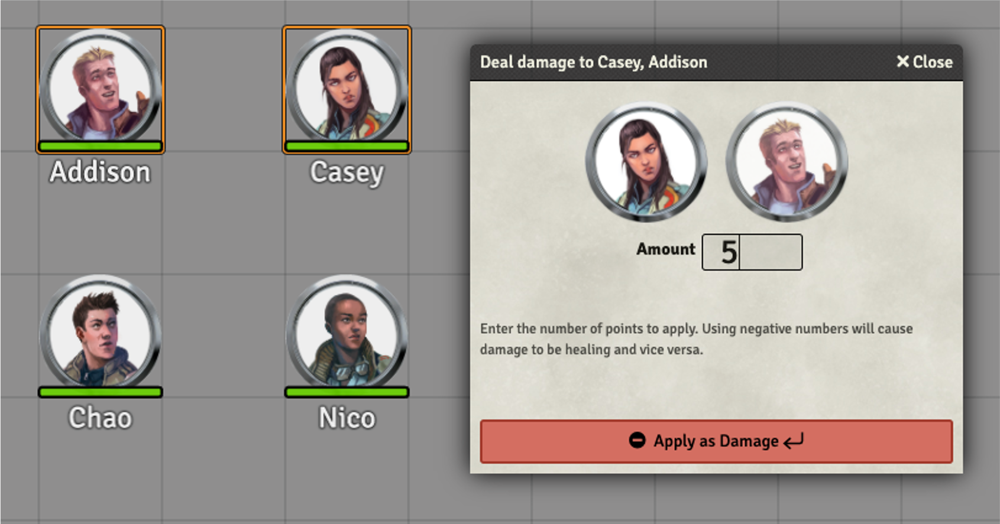
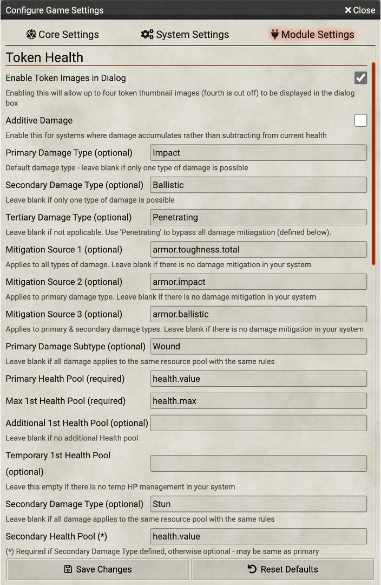
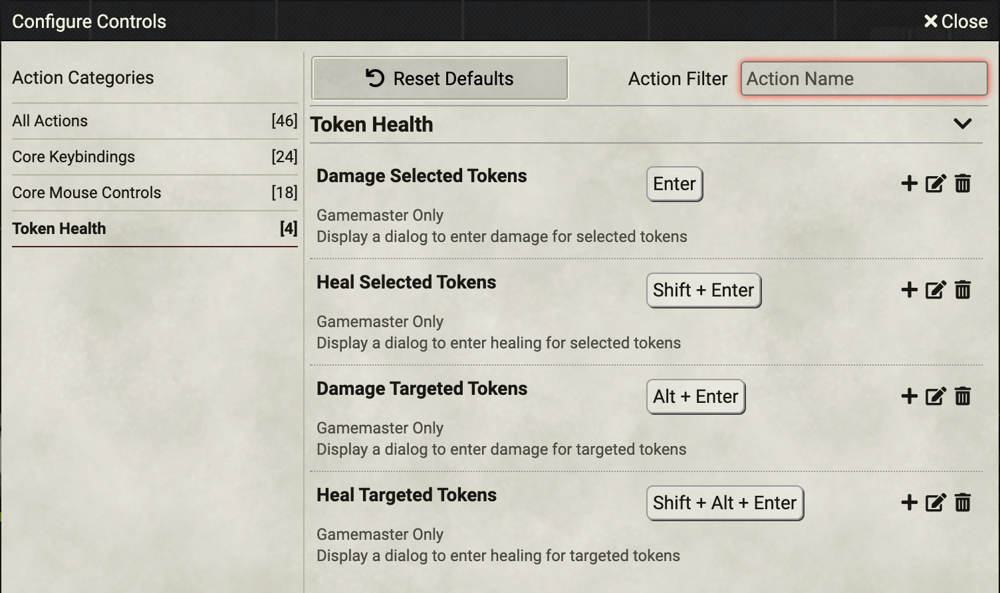

# Token Health

Apply damage/healing with a few keystrokes to all selected tokens at once.

⚠️ If your version is 0.1.3, you will have to reinstall the module.

## Description

This is a module for [FoundryVTT](https://foundryvtt.com/) intended for GMs that want to apply damage or healing more easily. Without this mod, you have to click several times to adjust the hit points of a token. With Token Health installed, you can press a hotkey (default: Enter), type the amount of damage or healing, and then press Enter to apply it.

Token Health also supports a detailed system of (optional) automatic token chat messages to alert players and GM to what's going on. All chat messages are user configurable, and only the GM will see messages that state how much damage or healing has been applied.

## Install

You can install this module directly from the "Add-on Modules" page on the FoudryVTT Setup screen. 

Make sure to enable the module once your world is launched, in the Manage Modules setting page. This module requires and depends on the Library: DF Hotkeys module which must also be installed and enabled.

## Usage

Before using Token Health it is recommended that you first check and configure the settings in the Module Settings. Token Health will automatically recognize and attempt to configure reasonable defaults based on the game system in use for the world and your language setting, but these may not always be the right settings for you, and you may want to tweak things to suit yourself. See **Module Configuration** below. Currently the following game systems have pre-defined default settings that should get you up and running:
- AGE System (unofficial)
- DnD5e - Fifth Edition System
- Legend of the Five Rings (5th Edition)
- Pathfinder 1
- Pathfinder 2nd Edition 
- Savage Worlds Adventure Edition
- TORG Eternity

If your preferred game system is not on that list then generic defaults will be used and it's **very likely** you'll need to do at least a minimum amount of configuration to make sure damage and healing are being applied to the correct attribute! If you would like to see your preferred system supported with default settings, or if you find an issue with the default settings applied to one of the systems listed above, please open an GitHub issue for this with specific details about the system you'd like supported and the settings you need.

### Use Token Health

1. Select/target one or multiple token(s)
1. Press the **hot key** (default: <kbd>Enter</kbd>) to display the Damage dialog or the **alternate hot key** (default: <kbd>Shift</kbd> + <kbd>Enter</kbd>) to display the Healing dialog. To apply damage/healing to **targeted tokens** instead of **selected tokens**, add the <kbd>Alt</kbd> key by default.
1. Enter a value
1. Validate by pressing <kbd>Enter</kbd> or by clicking the big button

### What you can do

- Multiple tokens may be selected. The name for each token selected will appear in the title bar of the dialog box.
- Optionally, up to four selected token icons will also be shown inside the dialog box with decreasing opacity (the fourth will be cut off)
	- This helps you ensure you've got the right tokens targeted before you apply damage or healing!
- Press the **hot key** and enter a value to apply **damage** to the selected token(s)
- Press the **key key** and enter a ***negative value*** to apply **healing** to the selected token(s)

- Press the **alternate hot key** and enter a value to apply **healing** to the selected token(s)
- Press the **alternate hot key** and enter a ***negative value*** to apply **damage** to the selected token(s)

- Combine above with the <kbd>Alt</kbd> key to apply to **targeted token(s)** instead of **selected token(s)**

### Output to Chat

Token Health will optionally create chat messages from each affected token indicating the effect and how much actual damage was done or healing received. This is particularly useful when applying damage to multiple tokens where damage mitigation is being employed and each token may be mitigating a different amount of damage.
- Token chat may be enabled/disabled through the module configuration settings (default: enabled)
- Tokens will output one message that's visible to everyone indicating the token's reaction to the effect
- Tokens also output an additional GM-Only message indicating the total amount of damage or healing done
- Tokens announce the following results in chat
	- When they are damaged or healed, with optionally different messages if the amount is trivial
	- If they're uneffected by damage/healing
	- If they've fallen unconscious (based on user configurable health threshold for unconsciousness)
	- If they die due to the damage applied (based on user configurable health threshold for death)
	- If damage is being applied to them but they were already dead
- Token chat messages default to language localizations, but each case may be overridden via module settings so they'll say what you want them to say

### Support for Additive Damage System
By default Token Health assumes that damage is to be subtracted from a current health value and that healing is added to health with a cap at a max health value. This works great for any system like D&D with a health or hp pool; however such behavior would be incompatible with systems where damage is additive - i.e. increasing from a base of 0 until some maximum threshold is reached or exceeded resulting in unconcousness or death. Additive damage systems like SWADE and L5R5E are now supported by checking the setting for Damage is Addative. In such systems healing will decrease the pool whereas apply damage will increase it. 

### AGE System Specific Features

- Damage Buyoff may be selected from the Module Configuration Screen (implements Injured and Wounded conditions)
- Damage Type may be selected from the pull down menu to the right of the Amount entry field
- Damage Subtype may be selected from the radio buttons below the Amount entry field
	- Wound damage may result in death and can trigger Damage Buyoff if that feature is enabled via Module Settings
	- Stun damage never results in death but can cause unconsciousness
- Additional Belter translation of Token Chat messages if the effected token has it's Origin set to Belter (Specific to The Expanse)

Damage Type selections are Impact (default), Ballisitic, and Penetraiting
- If Impact is selected, then either ordinary (impact) or specialized (ballisitic) armor will help to reduce the damage done
- If Ballistic is selected as the Damage Type, then only ballistic armor will be used for the armor-based mitigation of damage
- If Penetrating is selected, then all armor and/or tougness are bypassed and the full damage is applied
- NOTE: Damage mitigation by Tougness is set in the Game Settings in conjunction with the Damage Mitigation Attributes. If included, then Tougness adds to armor for Impact or Ballistic damage mitigation.
- Healing is **never** mitigated by armor or toughness

## Module Configuration

Configuratation of the Token Health module is accomplished in two parts: Hotkey settings which control how the module is launched and the Token Health module settings themselves which control the behavior and functionality of the module once launched. Both of these are shown below.
NOTE: Some settings are game system specific and may not work correctly (or at all) with game systems that don't support those features. When this is the case it is noted in the configuration setting field and the configuration hint below that. 

To configure the hotkeys used to launch Token Health open the Hotkey Settings dialog included in the Library: DF Hotkeys group. Within the Hotkeys settings dialog there is a Token Health group shown below. Here you can select exactly which combination of key and modifiers (Shift, Ctrl, Alt) are used to launch Token Health with the four behavior options possible.

By default the key used is the main keyboard Enter key. If you click the Key Binding popup menu you'll be able to select from any of the possible key presses DF Hotkeys is able to recognize - such as the Numpad Enter key, etc.

## Credits

### Original Version:
- by Discord user *thorni#4664*

### Localization
- **Français**: by ? and Google Translate
- **Español**: by Discord user *ForjaSalvaje#2419*.
- **Deutsch**: by Discord user *dabri0n#1632*
